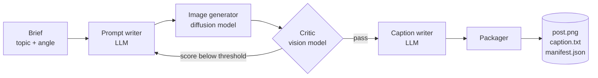

# persona-pipeline

A multi-stage AI orchestration pipeline that turns a one-line topic into a
ready-to-post image, caption, hashtags and alt text for a **virtual persona**,
while keeping the persona's look and voice consistent across every post.

Each step is handled by a different AI role (writer, image model, vision critic),
and every model sits behind a small interface, so vendors can be swapped through
config without touching pipeline code.



The critic loop is the core of the orchestration: a vision model scores every
image against the persona's rubric, and a weak image sends the critic's notes back
to the prompt writer for a revised prompt. The loop stops at the first image that
passes, and if none does, the best-scoring attempt is kept.

## Why this exists

Running an AI persona means making the same kind of decision many times a day:
write a prompt that matches the character, generate, check for broken hands or
off-style results, then write a caption in the right voice. This project turns
that loop into a traceable, testable pipeline.

## Features

- **Persona as config**: look, signature elements, lighting, camera, voice and
  hashtags live in one YAML file ([example](personas/example.yaml)).
- **Pluggable backends**: separate `text`, `image` and `vision` roles, each chosen
  by name in config.
- **Offline mock mode**: the whole pipeline runs with no API key, producing real
  image files, so anyone can clone and try it in seconds.
- **Run trace and checkpoints**: every stage is timed and logged into a
  `manifest.json` that is rewritten after each step, so a crash still leaves a
  readable record of how far the run got.
- **Self-correcting generation**: a vision critic scores each image and feeds
  concrete fixes back into the next prompt, up to `max_attempts`, keeping the best.
- **Structured outputs**: every model call asks for JSON against a schema and is
  validated with Pydantic before the next stage sees it.
- **Resilient model calls**: retries with backoff and jitter, plus automatic
  fallback to lighter models when the main one is overloaded.

## Quick start

```bash
git clone https://github.com/falakpat3l/persona-pipeline.git
cd persona-pipeline
python -m venv .venv && source .venv/bin/activate
pip install -e ".[dev]"

persona-pipeline run --persona personas/example.yaml --topic "Three tiny habits for deep focus"
```

Output:

```text
job 20260930-122615-desk-reset started: Desk reset
  prompt_writer    ok         0.5 ms  new, 244 chars via mock
  image_generator  ok        60.0 ms  1080x1350 via mock (attempt 1)
  critic           ok         0.2 ms  score 6.1 (below threshold) via mock
  prompt_writer    ok         0.1 ms  revised with critic notes, 328 chars via mock
  image_generator  ok        60.4 ms  1080x1350 via mock (attempt 2)
  critic           ok         0.2 ms  score 8.9 (pass) via mock
  review_loop      ok       123.3 ms  best 8.9 from attempt 2 of 2 (passed)
  caption_writer   ok         0.2 ms  63 chars, 4 hashtags
  packager         ok         0.3 ms  ready in outputs/20260930-122615-desk-reset
```

Each run gets its own folder:

```text
outputs/20260930-122615-desk-reset/
├── image_01.png     # every attempt is kept
├── image_02.png
├── post.png         # the best-scoring image
├── caption.txt      # caption + hashtags, ready to paste
├── alt_text.txt     # accessibility text
└── manifest.json    # full trace: brief, every attempt's prompt and score, timings
```

## Backends

| Role   | Available now    | Planned                        |
| ------ | ---------------- | ------------------------------ |
| text   | `mock`, `gemini` |                                |
| image  | `mock`           | `drawthings` (local), `gemini` |
| vision | `mock`, `gemini` |                                |

### Using Gemini

1. Get a free API key at [Google AI Studio](https://aistudio.google.com/apikey).
2. Install the extra and add your key:

   ```bash
   pip install -e ".[gemini]"
   echo "GEMINI_API_KEY=your-key-here" > .env
   ```

3. Run with Gemini writing the prompts and captions and judging the images:

   ```bash
   persona-pipeline run --persona personas/example.yaml --topic "Three tiny habits for deep focus" --text gemini --vision gemini
   ```

Every Gemini call uses structured output (a JSON schema per stage), checks the
reply before the next stage sees it, and retries rate limits (429), server errors
(5xx), dropped connections and malformed replies with exponential backoff and jitter. If the
main model stays overloaded, it falls back to lighter models (`fallback_models` in
the persona file), so a busy day at Google does not stop the run. `.env` is
git-ignored, so the key never lands in the repo.

Pick backends in the persona file, or override per run:

```bash
persona-pipeline run --persona personas/example.yaml --topic "..." --image mock
persona-pipeline backends   # list what is installed
```

## Project layout

```text
src/persona_pipeline/
├── pipeline.py          # orchestrator: ordering, critic loop, timing, checkpoints
├── config.py            # persona + pipeline settings (Pydantic)
├── models.py            # PostJob and the data passed between stages
├── retry.py             # exponential backoff with jitter
├── env.py               # tiny .env loader for API keys
├── backends/
│   ├── base.py          # TextBackend, ImageBackend, VisionBackend interfaces
│   ├── mock.py          # offline backends used by default and in tests
│   ├── gemini.py        # Gemini text + vision: structured JSON, retries, model fallback
│   └── __init__.py      # registry: config name -> backend class
└── stages/
    ├── prompt_writer.py
    ├── image_generator.py
    ├── critic.py
    ├── caption_writer.py
    └── packager.py
```

## Adding a stage

A stage is a class with a `name` and a `run(job, ctx)` method that reads from and
writes to the shared `PostJob`:

```python
from persona_pipeline.stages import Stage

class Watermark(Stage):
    name = "watermark"

    def run(self, job, ctx):
        ...  # edit job.image.path
        return "added corner mark"
```

Pass a custom list to `Pipeline(config, stages=[...])` to change the flow. A
`ReviewLoop(generate=..., review=..., revise=...)` step wraps any generator and
critic in the same feedback loop.

## Tests

```bash
pytest
ruff check .
```

## License

MIT
